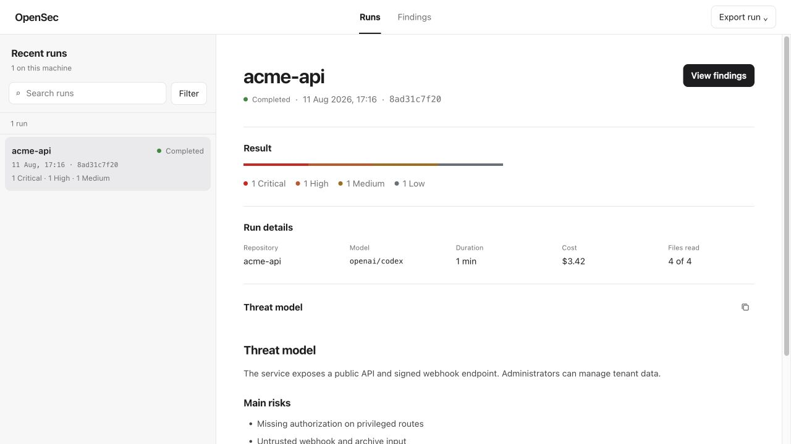
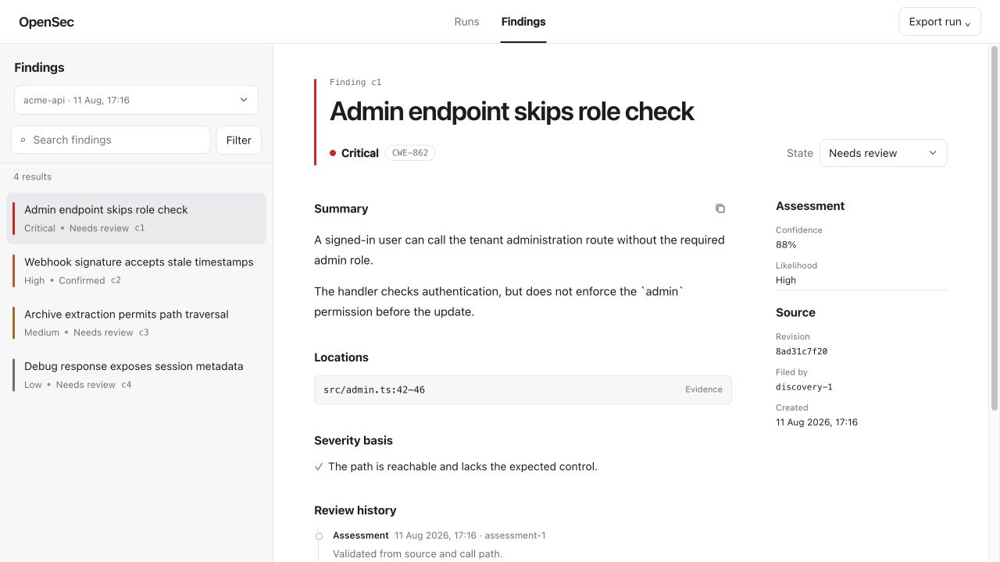

# OpenSec

OpenSec runs security-review agents against a repository, checks their findings, and stores the result in a local SQLite ledger. The CLI and review UI run on your machine; there is no hosted service.

> OpenSec is in early development. Review its findings before acting on them, and do not treat a clean report as proof that a system is secure.

## How it works

```text
Repository
  → inventory and threat model
  → parallel discovery agents
  → validation and severity checks
  → duplicate removal and report
  → local review UI and exports
```

## Install

OpenSec needs Node.js 22.19+, Docker Engine 28+, and macOS or Linux. Use WSL2 on Windows.

```sh
npm install --global opensec
opensec --version
```

OpenSec uses provider keys already in your environment or the credentials stored by `pi`. It never reads `.env` files from the repository under review.

```sh
opensec env
opensec models
opensec scan /path/to/repository --model provider/model
opensec review
```

Run `opensec scan . --estimate` to estimate a scan without calling a model. Run `opensec --help` for scan limits, cost controls, diff scans, exports, and CI options.

## What you can do

- Review runs and filter findings by run, repository, severity, or state.
- Confirm, suppress, follow up, or comment on a finding.
- Inspect the threat model, evidence, source locations, cost, and coverage.
- Export JSON, CSV, SARIF, or a read-only HTML snapshot.
- Resume interrupted scans and set CI severity thresholds.





Review data stays in `~/.opensec/opensec.db`. Exports can contain sensitive code-review data, so inspect them before sharing.

## Develop

```sh
git clone https://github.com/Cecuro/open-security.git
cd open-security
npm ci
npm run release:check
```

See [CONTRIBUTING.md](CONTRIBUTING.md) before opening a pull request. Report security flaws through [SECURITY.md](SECURITY.md), not a public issue.

## License

Apache-2.0. See [LICENSE](LICENSE).
